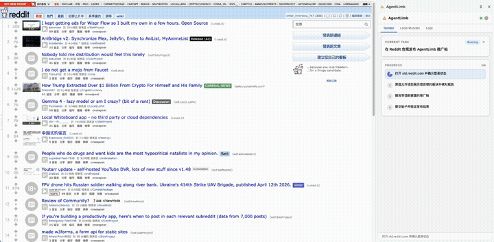

<p align="center">
  
</p>

<h1 align="center">AgentLimb</h1>

<p align="center">
  <strong>AI가 같은 작업을 다시 배우는 것을 지켜보는 것을 멈추세요.</strong><br>
  CoWork의 오픈소스 대안 — 반복 브라우저 작업에서 90% 더 적은 토큰.
</p>

<p align="center">
  <a href="https://chromewebstore.google.com/detail/agentlimb/hldldfepjhljhbcneojddjkkodkjglof">
    
  </a>
  <a href="https://agentlimb.com">
    
  </a>
  <a href="https://github.com/hooosberg/AgentLimb">
    
  </a>
</p>

<p align="center">
  <em>AgentLimb가 도움이 됐다면 이 저장소에 ⭐ 별을 눌러주세요 — 다른 사람들이 프로젝트를 발견하는 데 도움이 됩니다!</em>
</p>

<p align="center">
  <strong>
    <a href="../README.md">English</a> &nbsp;|&nbsp;
    <a href="./README.zh-CN.md">中文</a> &nbsp;|&nbsp;
    <a href="./README.ja-JP.md">日本語</a> &nbsp;|&nbsp;
    <a href="./README.ko-KR.md">한국어</a> &nbsp;|&nbsp;
    <a href="./README.es-ES.md">Español</a> &nbsp;|&nbsp;
    <a href="./README.fr-FR.md">Français</a> &nbsp;|&nbsp;
    <a href="./README.de-DE.md">Deutsch</a> &nbsp;|&nbsp;
    <a href="./README.pt-BR.md">Português</a> &nbsp;|&nbsp;
    <a href="./README.ru-RU.md">Русский</a> &nbsp;|&nbsp;
    <a href="./README.ar-SA.md">العربية</a> &nbsp;|&nbsp;
    <a href="./README.it-IT.md">Italiano</a> &nbsp;|&nbsp;
    <a href="./README.hi-IN.md">हिन्दी</a>
  </strong>
</p>

<p align="center">
  
</p>

---

## 소개

**AgentLimb**는 [Chrome Web Store에 출시된](https://chromewebstore.google.com/detail/agentlimb/hldldfepjhljhbcneojddjkkodkjglof) Chrome 확장 프로그램으로, 모든 AI 터미널 — Claude Code, Cursor, Codex, Trae, Windsurf, 또는 모든 로컬 모델 — 이 브라우저를 정밀하게 제어할 수 있게 해줍니다. 확장 프로그램 설치, 프롬프트 복사, AI에 붙여넣기 — 10초 만에 자동 구성 완료.

헤드리스 브라우저 없음. 재로그인 없음. 침입형 에이전트 없음. 실제 Chrome, 실제 쿠키, 실제 세션 — 반복 작업을 매번 더 저렴하게 만드는 근육 기억 포함.

## 주요 특징

### 1. 원 프롬프트 설정

프롬프트 하나만 복사해서 아무 AI 도구에 붙여넣기. 설정 파일 없음, 터미널 명령 없음, API 키 없음. AI가 명령을 실행할 수 있으면 AgentLimb를 사용할 수 있습니다.

### 2. 근육 기억 — 85% 적은 토큰, 80–95% 적은 대기 시간

AI가 처음 사이트를 방문할 때 DOM을 탐색하고 선택자와 워크플로우를 학습합니다. AgentLimb는 그 지식을 `~/Desktop/AgentLimb-muscle/<domain>.json`에 저장합니다. 이후 같은 사이트의 모든 실행은 탐색을 건너뛰고 학습된 내용을 재사용합니다.

Reddit 게시 작업의 실제 회귀 데이터 (저매개변수 Codex, 2026-04-18):

| | 콜드 스타트 (첫 탐색) | 핫 스타트 (근육 기억 재사용) | 절감 |
|---|---|---|---|
| `page_snapshot` 호출 횟수 | 3 | **0** | 100% |
| 총 도구 호출 수 | 23 | 10 | 56.5% |
| 추정 토큰 | ~12,250 | **~1,750** | **↓ 85.7%** |
| 실제 소요 시간 | 8–20분 | 30초–2분 | **↓ ~80–95%** |

사이트를 재사용할수록 더 저렴하고 빨라집니다.

### 3. CDP 네이티브, 스크린샷 추측 없음

AgentLimb는 Chrome Debugger Protocol을 통해 브라우저를 제어합니다. AI는 스크린샷이 아닌 인터랙티브 요소의 구조화된 시맨틱 목록을 받습니다. 클릭은 올바른 노드에 정확히 적중하고, 폼은 네이티브 API를 사용하며, 내비게이션은 새 URL을 즉시 반환합니다.

### 4. 명시적 작업 생명 주기

침묵이 더 이상 성공을 의미하지 않습니다. AI는 명시적으로 `task_plan` → `task_step_done` → `task_complete` / `task_fail`을 선언합니다. 타임아웃과 브리지 연결 끊김은 실제 실패로 기록됩니다. 사이드 패널은 실시간으로 단계 목록을 렌더링합니다.

### 5. 100% 로컬 & 프라이빗

브리지는 `127.0.0.1:7791`에서 실행됩니다. 분석 없음, 추적 없음, 클라우드 없음. 근육 지식은 데스크탑의 평문 JSON — 언제든지 읽고, 비교하고, 공유하거나 삭제할 수 있습니다.

## 작동 방식

```
AI 터미널  (Claude Code / Cursor / Codex / Trae / Windsurf / 로컬 모델)
    ↕  HTTP + SSE  (16개의 표준화 도구, /docs 엔드포인트로 자동 발견)
AgentLimb Bridge  (로컬 Node.js · 127.0.0.1:7791)
    ↕  chrome.runtime 메시지 전달
AgentLimb Extension  (Chrome MV3 · 사이드 패널 UI · 작업/근육/로그 탭)
    ↕  Chrome Debugger Protocol
브라우저  (로그인됨, 쿠키 포함, 실제 세션)
    ↓  지식 영속화
~/Desktop/AgentLimb-muscle/<domain>.json  (영구적, 사람이 읽을 수 있음)
```

## 빠른 시작

1. **설치** — 두 가지 방법:
   - **Chrome Web Store** (권장): [AgentLimb 설치](https://chromewebstore.google.com/detail/agentlimb/hldldfepjhljhbcneojddjkkodkjglof) — 클릭 한 번, 자동 업데이트
   - **수동 (최신 빌드)**: [최신 zip 다운로드](https://github.com/hooosberg/AgentLimb/releases/latest), 압축 해제, `chrome://extensions` 열기, **개발자 모드** 활성화, **압축해제된 항목 로드** 클릭
2. **복사** — 사이드 패널에서 "온보드 프롬프트 복사" 클릭
3. **붙여넣기** — 아무 AI 터미널에 붙여넣기. 자동 연결되고, 도구 스키마를 온디맨드로 가져오며, 작업을 시작합니다

## 도구 세트 — 16개 도구

5개 카테고리에 걸친 16개의 표준화 도구: 브라우저 상태 관찰, 페이지 요소 탐색 및 상호작용, 근육 기억 읽기 및 쓰기, 작업 생명 주기 이벤트 선언, 브리지 연결 유지. 완전한 문서는 온디맨드로 제공되며, AI는 필요할 때만 스키마를 가져옵니다.

## 그냥 X를 쓰면 안 되나요?

기존의 모든 브라우저 자동화 방식에는 실제 비용이 있습니다. 정직한 비교입니다:

| | Browser Use / Playwright | BrowseAI / Browserbase | Codex / Claude Computer Use | **AgentLimb** |
|---|---|---|---|---|
| **설정** | 스크립트 작성, 의존성 관리, 헤드리스 모드 처리 | SaaS 설정, 워크플로우별 구성 | Mac 전용 (데스크톱 환경 필요), 샌드박스 필수 | 프롬프트 하나 복사. 끝 |
| **요소 타겟팅** | CSS/XPath——직접 작성하고 유지 관리 | 시각 AI 감지——업데이트 시 불안정 | 스크린샷 좌표——±1픽셀이면 빗나갑니다 | CDP가 실시간 DOM 직접 읽기——시맨틱, 정확 |
| **작업당 토큰 비용** | 없음 (순수 스크립트) | 클라우드 요금 + AI 토큰 | 1,000–3,000 토큰/스크린샷 × 매 단계 | 약 300 토큰/단계, 핫 스타트 시 **85.7% 절감** |
| **반복 작업 비용** | 고정 (스크립트 재실행) | 선형 증가——실행마다 과금 | 선형 증가——매번 재탐색, 기억 없음 | **감소**——근육 기억이 누적 |
| **로그인 세션** | 쿠키/세션 별도 설정 | 클라우드——로컬 세션 사용 불가 | OS 레벨, 브라우저 상태를 모름 | 실제 Chrome——이미 로그인됨 |
| **사이트 업데이트 시** | 셀렉터 깨짐——스크립트 재작성 | 시각 모델이 조용히 저하될 수 있음 | 스크린샷 추론으로 대응하지만 비쌉니다 | AI가 불일치를 감지, 새 셀렉터를 찾아 근육을 자동 복구 |
| **데이터 프라이버시** | 로컬 ✅ | 타사 서버 경유 ❌ | 로컬 ✅ | 100% 로컬——127.0.0.1 전용 ✅ |
| **AI 터미널 선택** | 무엇이든 (순수 스크립트) | 플랫폼에 따라 다름 | Codex / Claude에 번들 | HTTP를 말할 수 있는 모든 AI |
| **공유 지식** | 스크립트 = 하나의 AI에 고정 | 워크플로우 = 플랫폼에 고정 | 영구 기억 없음 | 근육 파일 = AI 간 이동 가능, 영구적 |

**차별점**: AgentLimb의 근육 파일은 `~/Desktop/AgentLimb-muscle/`에 일반 JSON으로 저장됩니다. 오늘 Claude Code가 탐색한 지식을 내일 Codex가 그대로 사용할 수 있습니다——같은 파일, 재탐색 제로. AI 도구를 바꿔도 학습된 워크플로우를 하나도 잃지 않습니다.

## 사용 사례

- **마케팅** — 소셜 미디어 게시, 여러 플랫폼에서 캠페인 관리
- **리서치** — 데이터 스크래핑, 제품 비교, 경쟁사 분석
- **자동화** — 폼 작성, 지원서 제출, 프로필 업데이트
- **테스팅** — 실제 브라우저와 실제 세션으로 웹앱 QA

## 설계 철학

- **최소 인터페이스** — 16개 도구, 각각 한 가지를 잘하며, 모든 워크플로우에서 조합 가능
- **비침습적** — 샌드박스가 아닌 실제 브라우저 내에서 작동
- **로컬 우선** — 약속이 아닌 아키텍처로 보장하는 프라이버시
- **AI 무관** — HTTP를 전송할 수 있는 모든 도구 연결 가능; 벤더 종속 없음

## 리소스

- **웹사이트**: [agentlimb.com](https://agentlimb.com)
- **튜토리얼**: [agentlimb.com/tutorials.html](https://agentlimb.com/tutorials.html)
- **AI 도구 디렉토리**: [agentlimb.com/tools.html](https://agentlimb.com/tools.html)
- **뉴스**: [agentlimb.com/news.html](https://agentlimb.com/news.html)
- **개인정보처리방침**: [agentlimb.com/privacy.html](https://agentlimb.com/privacy.html)
- **서비스 약관**: [agentlimb.com/terms.html](https://agentlimb.com/terms.html)
- **라이선스**: [agentlimb.com/license.html](https://agentlimb.com/license.html)

## 연락처

- **GitHub**: [hooosberg/AgentLimb](https://github.com/hooosberg/AgentLimb)
- **이메일**: [zikedece@proton.me](mailto:zikedece@proton.me)

## 다른 프로젝트

<table>
  <tr>
    <td align="center">
      <a href="https://hooosberg.github.io/WitNote/">
        <b>✍️ WitNote</b><br>
        <sub>AI 글쓰기 동반자</sub>
      </a>
    </td>
    <td align="center">
      <a href="https://hooosberg.github.io/DOMPrompter/">
        <b>🎯 DOMPrompter</b><br>
        <sub>비주얼 AI 프롬프트 생성기</sub>
      </a>
    </td>
    <td align="center">
      <a href="https://hooosberg.github.io/GlotShot/">
        <b>📸 GlotShot</b><br>
        <sub>App Store 스크린샷</sub>
      </a>
    </td>
    <td align="center">
      <a href="https://hooosberg.github.io/TrekReel/">
        <b>🏔️ TrekReel</b><br>
        <sub>3D 트레일 스토리</sub>
      </a>
    </td>
    <td align="center">
      <a href="https://uixskills.com/">
        <b>🎨 UIXskills</b><br>
        <sub>디자인 프로토콜 레이어</sub>
      </a>
    </td>
  </tr>
</table>

## 라이선스

[Business Source License 1.1](../LICENSE) — 개인 사용 무료. 상업적 사용은 라이선스 필요. 2030-04-12에 Apache 2.0으로 전환.

Copyright © 2025 hooosberg. All rights reserved.
